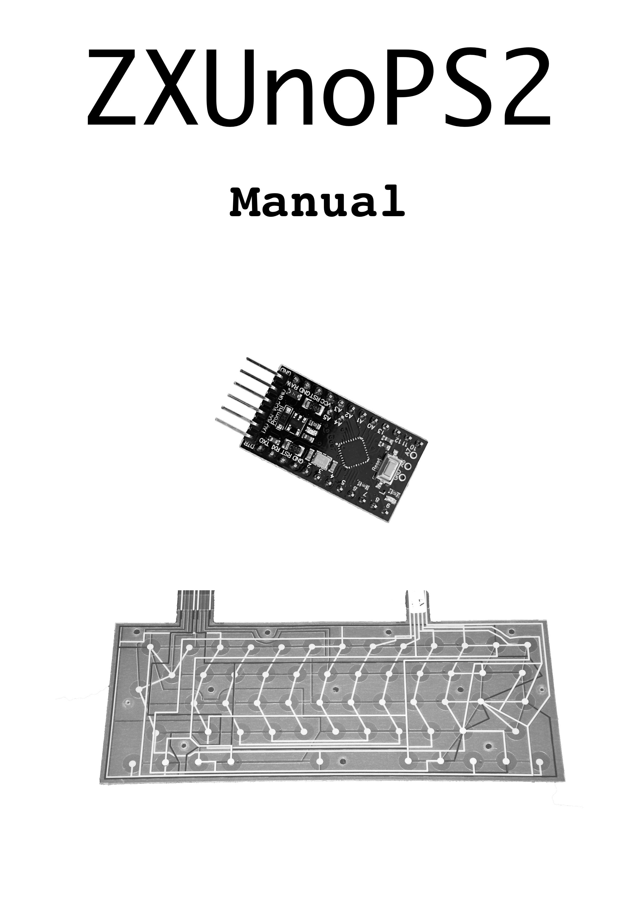
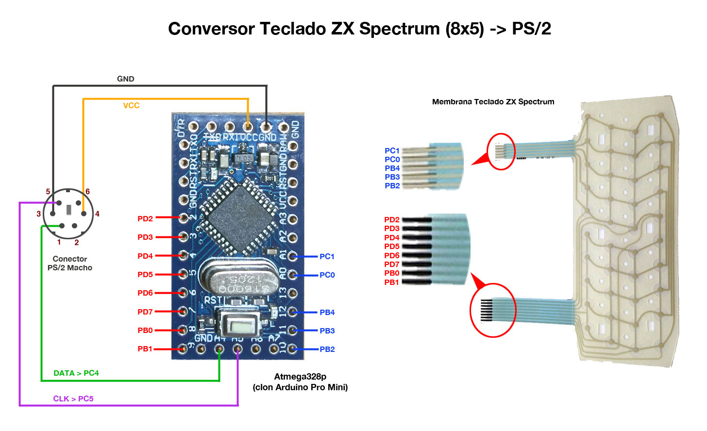

= zxunops2 manual
:author: kounch
:revnumber: 1.0.0
:doctype: book
:notitle:
:front-cover-image: 
:email: kounch@users.noreply.github.com
:Revision: 1.0
:description: English zxunps2 Manual
:keywords: Manual, English, zxunops2
:icons: font
:source-highlighter: rouge
:toc: left
:toc-title: Index
:toclevels: 4

<<<

== Introduction

zxunops2 is a converter from ZX Spectrum membrane keyboard to PS/2, used to control a ZX-Uno.

- Quest Original code base
- Neuro (@neurorulez) https://github.com/neurorulez/zx1ps2[First version] and keyboard shortcuts
- @spark2k06 improvements, optimizations and new keyboard shortcuts
- Thanks to @desUBIkado for being a tester and give new ideas for the alternate version

The connection is through an Arduino board, which converts the key presses to PS/2 protocol, using https://github.com/spark2k06/zxunops2[zxunops2 firmware]. The board is programmed in such a way that it can behave differently (keyboard mode), according to your needs.

[.text-center]

include::zxunops2_en.adoc[]
